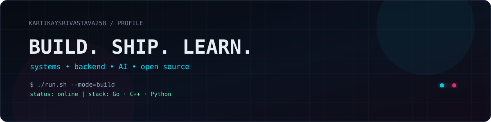
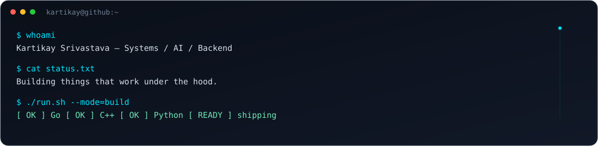

 

 

  

<h2>⚡ About me</h2>

<table width="100%">
<tr>
<td width="33%" valign="top"><h3>01 / Core</h3><code>Go</code> · <code>C++</code> · <code>Python</code></td>
<td width="33%" valign="top"><h3>02 / Building</h3>Backend systems, developer tools, AI projects & open source.</td>
<td width="33%" valign="top"><h3>03 / Mindset</h3>Build it. Break it. Understand it. Ship it better.</td>
</tr>
</table>

TypeScript is part of the toolbox — Go, C++ and Python are the core stack.

<h2>🧠 What I work with</h2>

<code>backend</code> <code>systems</code> <code>APIs</code> <code>AI / RAG</code> <code>databases</code> <code>DSA</code> <code>open-source</code>

<h2>🚀 Selected builds</h2>
<table width="100%">
<tr>
<td width="50%" valign="top"><h3><a href="https://github.com/KartikaySrivastava258/Mini-Orchestrator">Mini-Orchestrator</a></h3>
Developer tooling project focused on orchestration and automation.
TypeScript · ⭐ 1</td>
<td width="50%" valign="top"><h3><a href="https://github.com/KartikaySrivastava258/sehat-companion">sehat-companion</a></h3>
A public project built around a health-focused companion experience.
TypeScript · ⭐ 0</td>
</tr>
<tr>
<td width="50%" valign="top"><h3><a href="https://github.com/OpinionatedDeer/PBL-III-Python-Backend">PBL-III-Python-Backend</a></h3>
Sem III PBL backend implementation.
Python · ⭐ 0</td>
<td width="50%" valign="top"><h3><a href="https://github.com/KartikaySrivastava258/LEETCODE-AND-GEEKS-DSA-QUESTIONS">DSA Quest</a></h3>
LeetCode and GeeksForGeeks solutions for sharpening problem-solving skills.
C++ · ⭐ 0</td>
</tr>
</table>

<h2>📊 GitHub telemetry</h2>

<h2>🐍 Contribution protocol</h2>

Commits go in. Contributions come alive. The snake keeps moving.

<h2>📡 Current signal</h2>
<table width="100%"><tr>
<td align="center"><strong>8</strong> Public repos</td>
<td align="center"><strong>251</strong> Contributions</td>
<td align="center"><strong>40</strong> Active days</td>
<td align="center"><strong>2</strong> Stars</td>
</tr></table>

<a href="https://github.com/KartikaySrivastava258">GitHub</a> · <a href="https://github.com/KartikaySrivastava258/KartikaySrivastava258">Profile source</a>

<code>kartikay@github:~$</code> keep building.

